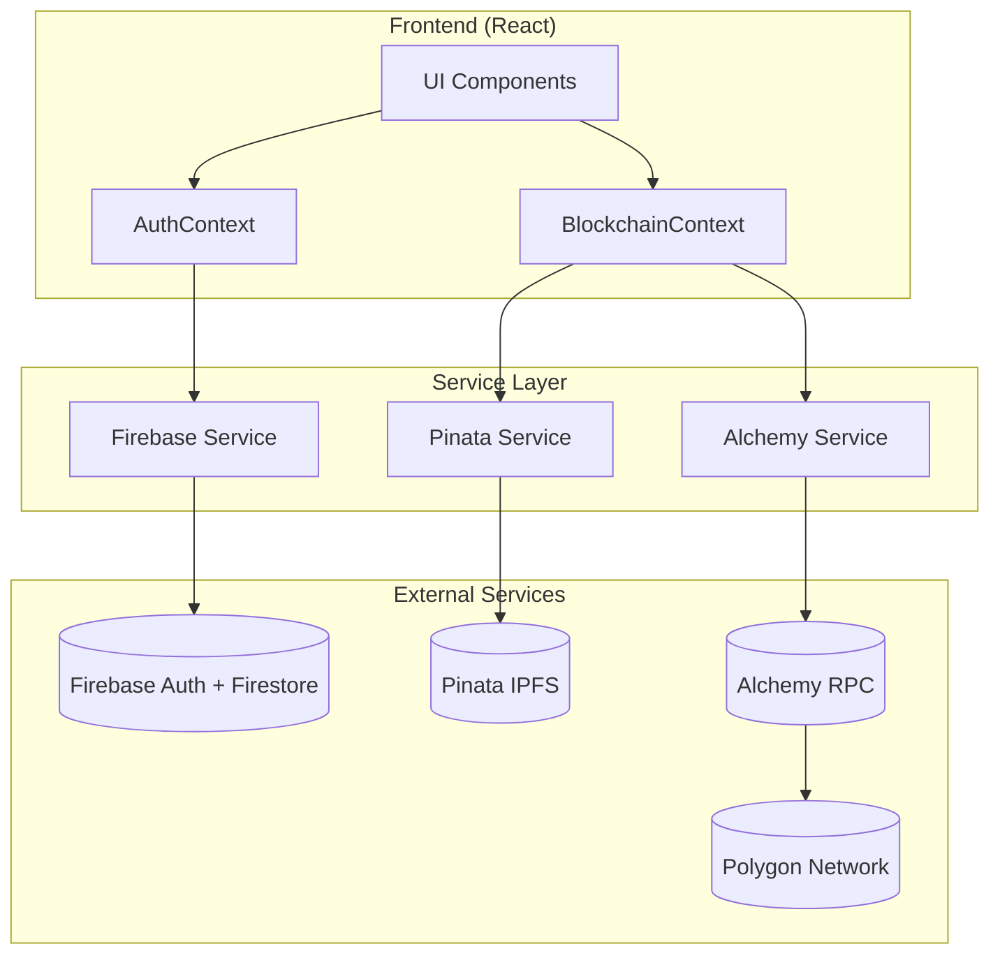

# Design Document: API Integration

## Overview

This design document outlines the architecture for integrating Firebase, Pinata IPFS, and Alchemy RPC into the decentralized academic credential verification system. The integration transforms the current mock-based prototype into a functional system with real authentication, decentralized storage, and blockchain connectivity.

The architecture follows a layered approach:
1. **Configuration Layer**: Environment-based API key management
2. **Service Layer**: Abstracted service modules for each integration
3. **Context Layer**: React context providers for state management
4. **UI Layer**: Components that consume the services

## Architecture



## Components and Interfaces

### 1. Configuration Module (`src/config/firebase.js`, `src/config/services.js`)

```javascript
// src/config/firebase.js
export const firebaseConfig = {
  apiKey: import.meta.env.VITE_FIREBASE_API_KEY,
  authDomain: import.meta.env.VITE_FIREBASE_AUTH_DOMAIN,
  projectId: import.meta.env.VITE_FIREBASE_PROJECT_ID,
  storageBucket: import.meta.env.VITE_FIREBASE_STORAGE_BUCKET,
  messagingSenderId: import.meta.env.VITE_FIREBASE_MESSAGING_SENDER_ID,
  appId: import.meta.env.VITE_FIREBASE_APP_ID
};

// src/config/services.js
export const servicesConfig = {
  pinata: {
    apiKey: import.meta.env.VITE_PINATA_API_KEY,
    secretKey: import.meta.env.VITE_PINATA_SECRET_KEY,
    jwt: import.meta.env.VITE_PINATA_JWT
  },
  alchemy: {
    apiKey: import.meta.env.VITE_ALCHEMY_API_KEY,
    network: 'polygon-mainnet' // or 'polygon-amoy' for testnet
  }
};
```

### 2. Firebase Service (`src/services/firebaseService.js`)

```javascript
interface FirebaseService {
  // Authentication
  signUp(email: string, password: string): Promise<UserCredential>
  signIn(email: string, password: string): Promise<UserCredential>
  signInWithGoogle(): Promise<UserCredential>
  signOut(): Promise<void>
  onAuthStateChanged(callback: (user: User | null) => void): Unsubscribe
  
  // User Profile (Firestore)
  createUserProfile(uid: string, data: UserProfile): Promise<void>
  getUserProfile(uid: string): Promise<UserProfile | null>
  updateUserProfile(uid: string, data: Partial<UserProfile>): Promise<void>
  
  // Credential References (for non-wallet users)
  addCredentialRef(uid: string, credentialHash: string): Promise<void>
  getCredentialRefs(uid: string): Promise<string[]>
}

interface UserProfile {
  uid: string
  email: string
  displayName: string
  role: 'student' | 'university' | 'employer' | 'government' | 'admin'
  walletAddress?: string
  createdAt: Timestamp
  updatedAt: Timestamp
}
```

### 3. Pinata IPFS Service (`src/services/pinataService.js`)

```javascript
interface PinataService {
  // Upload JSON metadata to IPFS
  uploadJSON(data: object): Promise<PinataResponse>
  
  // Upload file to IPFS
  uploadFile(file: File): Promise<PinataResponse>
  
  // Fetch content by CID
  fetchByCID(cid: string): Promise<object>
  
  // Check pin status
  getPinStatus(cid: string): Promise<PinStatus>
}

interface PinataResponse {
  IpfsHash: string  // CID
  PinSize: number
  Timestamp: string
}
```

### 4. Alchemy/Blockchain Service (`src/services/alchemyService.js`)

```javascript
interface AlchemyService {
  // Provider management
  getProvider(): JsonRpcProvider
  getSigner(): Signer
  
  // Contract interactions
  getContract(address: string, abi: ABI): Contract
  
  // Credential operations (via smart contract)
  issueCredential(studentDID: string, hash: string, ipfsCID: string): Promise<TransactionReceipt>
  verifyCredential(hash: string): Promise<CredentialRecord | null>
  revokeCredential(hash: string): Promise<TransactionReceipt>
  
  // Network info
  getNetworkInfo(): Promise<NetworkInfo>
  getBlockNumber(): Promise<number>
}
```

### 5. Auth Context (`src/contexts/AuthContext.jsx`)

New context specifically for Firebase authentication, separate from blockchain context:

```javascript
interface AuthContextValue {
  user: User | null
  profile: UserProfile | null
  loading: boolean
  error: string | null
  
  // Auth methods
  signUp: (email: string, password: string, displayName: string, role: string) => Promise<void>
  signIn: (email: string, password: string) => Promise<void>
  signInWithGoogle: () => Promise<void>
  signOut: () => Promise<void>
  
  // Profile methods
  updateProfile: (data: Partial<UserProfile>) => Promise<void>
  linkWallet: (address: string) => Promise<void>
}
```

### 6. Updated Blockchain Context

The existing `BlockchainContext` will be updated to:
- Use real Pinata IPFS instead of mock
- Use Alchemy RPC for blockchain operations
- Integrate with AuthContext for user identity

## Data Models

### Firestore Collections

```
users/
  {uid}/
    email: string
    displayName: string
    role: string
    walletAddress?: string
    createdAt: timestamp
    updatedAt: timestamp
    credentialRefs: string[]  // For non-wallet users

credentials/
  {hash}/
    issuer: string
    studentDID: string
    ipfsCID: string
    issuedAt: timestamp
    isValid: boolean
```

### IPFS Credential Metadata

```json
{
  "version": "1.0",
  "type": "academic_credential",
  "studentDID": "0x...",
  "studentName": "John Doe",
  "issuer": {
    "address": "0x...",
    "name": "University of Technology"
  },
  "credential": {
    "type": "degree",
    "title": "Bachelor of Science",
    "field": "Computer Science",
    "issuedDate": "2024-01-15",
    "expiryDate": null
  },
  "metadata": {
    "createdAt": 1705312800000,
    "hash": "0x..."
  }
}
```

## Correctness Properties

*A property is a characteristic or behavior that should hold true across all valid executions of a system—essentially, a formal statement about what the system should do. Properties serve as the bridge between human-readable specifications and machine-verifiable correctness guarantees.*

### Property 1: User Registration Creates Complete Profile

*For any* valid email, password, and role combination, when a user signs up, the resulting Firestore document SHALL contain all required fields (uid, email, displayName, role, createdAt) and the uid SHALL match the Firebase Auth uid.

**Validates: Requirements 1.2, 2.1**

### Property 2: Logout Clears All Auth State

*For any* authenticated user, after calling signOut, the auth state SHALL be null and no user session data SHALL remain in local storage.

**Validates: Requirements 1.5**

### Property 3: Profile Persistence Round-Trip

*For any* valid profile update, reading the profile immediately after update SHALL return data equivalent to what was written.

**Validates: Requirements 2.4, 2.5**

### Property 4: Wallet Association Persistence

*For any* valid Ethereum address, when linked to a user profile, subsequent profile reads SHALL include that wallet address.

**Validates: Requirements 2.3**

### Property 5: IPFS Upload Round-Trip

*For any* valid credential metadata object, uploading to Pinata and then fetching by the returned CID SHALL produce an object equivalent to the original.

**Validates: Requirements 3.1, 3.2, 3.3**

### Property 6: IPFS Pin Verification

*For any* successfully uploaded content, querying the pin status SHALL return a valid pinned status.

**Validates: Requirements 3.5**

### Property 7: Transaction Hash Format

*For any* successfully submitted blockchain transaction, the returned hash SHALL be a valid 66-character hexadecimal string starting with "0x".

**Validates: Requirements 4.4**

### Property 8: Custodial Identifier Generation

*For any* Firebase-authenticated user without a wallet, the system SHALL generate a unique custodial identifier, and credentials issued to that identifier SHALL be retrievable from Firestore.

**Validates: Requirements 5.1, 5.2**

### Property 9: Non-Wallet User Restrictions

*For any* user without a connected wallet, attempting on-chain operations SHALL be rejected with an appropriate error.

**Validates: Requirements 5.4**

### Property 10: Environment Variable Validation

*For any* missing required environment variable, the configuration validation SHALL throw an error identifying the missing variable.

**Validates: Requirements 6.2**

## Error Handling

### Authentication Errors
- `auth/email-already-in-use`: Display "Email already registered"
- `auth/invalid-credential`: Display "Invalid email or password"
- `auth/user-not-found`: Display "No account found with this email"
- `auth/weak-password`: Display "Password must be at least 6 characters"

### IPFS Errors
- Network timeout: Retry up to 3 times with exponential backoff
- Invalid CID: Display "Content not found"
- Upload failure: Display "Failed to upload document, please try again"

### Blockchain Errors
- Insufficient funds: Display "Insufficient funds for transaction"
- Contract revert: Parse revert reason and display
- Network error: Attempt reconnection, display "Network unavailable"

## Testing Strategy

### Unit Tests
- Test Firebase service methods with Firebase emulator
- Test Pinata service with mock responses for error cases
- Test configuration validation with various env combinations

### Property-Based Tests
Using a property-based testing library (e.g., fast-check):

1. **Profile Round-Trip**: Generate random valid profiles, write and read back
2. **IPFS Round-Trip**: Generate random credential metadata, upload and fetch
3. **Wallet Address Validation**: Generate random addresses, verify format validation
4. **Environment Validation**: Generate random env configurations, verify validation

### Integration Tests
- End-to-end auth flow with Firebase emulator
- Credential issuance flow with Pinata (testnet)
- Full verification flow

### Test Configuration
- Minimum 100 iterations per property test
- Use Firebase emulator for auth tests
- Use Polygon Amoy testnet for blockchain tests
- Tag format: **Feature: api-integration, Property {number}: {property_text}**
