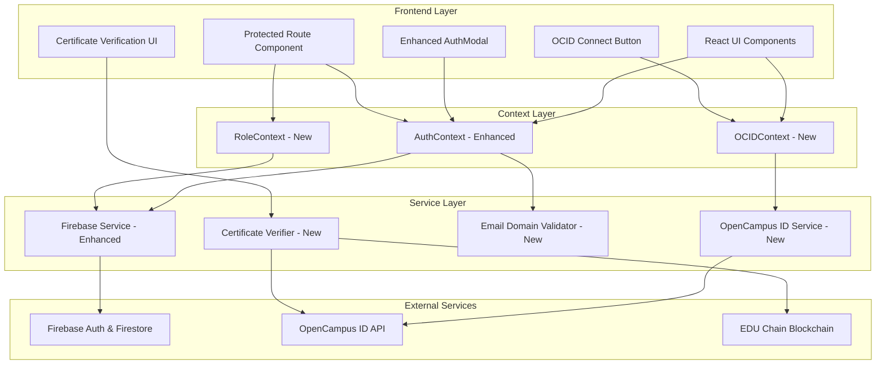

# Design Document: OpenCampus ID & Multi-Role Authentication Integration

## Overview

This design document outlines the architecture for integrating OpenCampus ID for certificate verification and implementing an enhanced multi-role authentication system. The solution leverages the `@opencampus/ocid-connect-js` SDK for OCID integration, extends the existing Firebase authentication with role-based access control, and implements email domain validation for institutional users.

## Architecture



## Components and Interfaces

### 1. OpenCampus ID Service (`src/services/opencampusService.js`)

```javascript
// OpenCampus ID Service Interface
interface OCIDConfig {
  clientId: string;           // Required for production
  redirectUri: string;        // Callback URL after OCID auth
  sandboxMode: boolean;       // true for development
  referralCode?: string;      // Optional partner tracking
}

interface OCIDAuthState {
  isAuthenticated: boolean;
  isInitialized: boolean;
  accessToken: string | null;
  idToken: string | null;
  ocId: string | null;        // OpenCampus ID
  ethAddress: string | null;  // Connected wallet address
  error: string | null;
}

interface OCIDService {
  // Initialize OCID SDK
  initialize(config: OCIDConfig): Promise<void>;
  
  // Trigger OCID login flow
  signInWithOCID(state?: string): Promise<void>;
  
  // Handle redirect callback
  handleCallback(): Promise<OCIDAuthState>;
  
  // Get current auth state
  getAuthState(): OCIDAuthState;
  
  // Logout from OCID
  logout(returnUrl?: string): Promise<void>;
  
  // Verify JWT token
  verifyToken(token: string): Promise<boolean>;
}
```

### 2. Certificate Verification Service (`src/services/certificateVerificationService.js`)

```javascript
interface CredentialVerificationRequest {
  credentialId?: string;      // Credential hash or ID
  ocId?: string;              // Holder's OCID
  transactionHash?: string;   // Blockchain transaction hash
}

interface CredentialVerificationResult {
  isValid: boolean;
  status: 'verified' | 'invalid' | 'expired' | 'revoked' | 'not_found';
  credential?: {
    id: string;
    name: string;
    description: string;
    issuer: {
      name: string;
      ocId: string;
      verified: boolean;
    };
    holder: {
      name: string;
      ocId: string;
    };
    issuedAt: Date;
    expiresAt?: Date;
    achievementType: 'Achievement' | 'Badge' | 'Certificate';
    metadata: Record<string, any>;
  };
  verificationTimestamp: Date;
  blockchainProof?: {
    transactionHash: string;
    blockNumber: number;
    network: string;
  };
  error?: string;
}

interface CertificateVerificationService {
  // Verify credential by ID or hash
  verifyCredential(request: CredentialVerificationRequest): Promise<CredentialVerificationResult>;
  
  // Get credentials for an OCID
  getCredentialsByOCID(ocId: string): Promise<CredentialVerificationResult[]>;
  
  // Cache verification result
  cacheResult(credentialId: string, result: CredentialVerificationResult): void;
  
  // Get cached result if valid
  getCachedResult(credentialId: string): CredentialVerificationResult | null;
}
```

### 3. Email Domain Validator (`src/services/emailDomainValidator.js`)

```javascript
interface DomainValidationConfig {
  universityDomains: string[];    // ['.edu', '.ac.uk', '.edu.au']
  governmentDomains: string[];    // ['.gov', '.gov.uk', '.gov.au']
  adminWhitelist: string[];       // Specific admin emails
  customInstitutions: Record<string, string[]>; // Institution-specific domains
}

interface DomainValidationResult {
  isValid: boolean;
  suggestedRole?: 'student' | 'university' | 'government' | 'admin';
  reason?: string;
}

interface EmailDomainValidator {
  // Validate email for a specific role
  validateForRole(email: string, role: string): DomainValidationResult;
  
  // Suggest role based on email domain
  suggestRole(email: string): string;
  
  // Check if email is in admin whitelist
  isAdminEmail(email: string): boolean;
  
  // Get domain patterns for a role
  getDomainPatterns(role: string): string[];
}
```

### 4. Enhanced Auth Context (`src/contexts/AuthContext.jsx`)

```javascript
interface EnhancedAuthContextValue {
  // Existing properties
  user: FirebaseUser | null;
  profile: UserProfile | null;
  loading: boolean;
  error: string | null;
  isAuthenticated: boolean;
  
  // New role-based properties
  role: 'student' | 'university' | 'government' | 'admin' | 'employer';
  permissions: string[];
  canAccessRoute: (route: string) => boolean;
  
  // Enhanced methods
  signUp: (email: string, password: string, displayName: string, role: string) => Promise<void>;
  signIn: (email: string, password: string) => Promise<void>;
  signInWithGoogle: () => Promise<void>;
  signOut: () => Promise<void>;
  
  // New methods
  sendPasswordResetEmail: (email: string) => Promise<void>;
  confirmPasswordReset: (code: string, newPassword: string) => Promise<void>;
  switchRole: (newRole: string) => Promise<void>;
  validateEmailForRole: (email: string, role: string) => DomainValidationResult;
}
```

### 5. OCID Context (`src/contexts/OCIDContext.jsx`)

```javascript
interface OCIDContextValue {
  // Auth state
  isOCIDAuthenticated: boolean;
  isInitialized: boolean;
  ocId: string | null;
  ethAddress: string | null;
  
  // Methods
  connectOCID: () => Promise<void>;
  disconnectOCID: () => Promise<void>;
  
  // Credential verification
  verifyCredential: (credentialId: string) => Promise<CredentialVerificationResult>;
  getMyCredentials: () => Promise<CredentialVerificationResult[]>;
  
  // Loading states
  isConnecting: boolean;
  isVerifying: boolean;
  error: string | null;
}
```

### 6. Protected Route Component (`src/components/ProtectedRoute.jsx`)

```javascript
interface ProtectedRouteProps {
  children: React.ReactNode;
  allowedRoles?: string[];        // Roles that can access this route
  requireAuth?: boolean;          // Default: true
  requireOCID?: boolean;          // Require OCID connection
  redirectTo?: string;            // Custom redirect path
  fallback?: React.ReactNode;     // Loading fallback
}
```

## Data Models

### User Profile (Firestore - Enhanced)

```javascript
interface UserProfile {
  uid: string;
  email: string;
  displayName: string;
  role: 'student' | 'university' | 'government' | 'admin' | 'employer';
  secondaryRoles?: string[];      // For users with multiple roles
  
  // OCID Integration
  ocId?: string;                  // Linked OpenCampus ID
  ocIdLinkedAt?: Timestamp;
  ethAddress?: string;            // From OCID or MetaMask
  
  // Verification
  emailVerified: boolean;
  institutionVerified: boolean;
  institutionDomain?: string;
  
  // Session
  lastLoginAt: Timestamp;
  sessionVersion: number;         // For forced re-auth
  
  // Metadata
  createdAt: Timestamp;
  updatedAt: Timestamp;
}
```

### Verification Cache (Firestore)

```javascript
interface VerificationCache {
  credentialId: string;
  result: CredentialVerificationResult;
  cachedAt: Timestamp;
  expiresAt: Timestamp;           // 24 hours from cachedAt
}
```

### Role Permissions Map

```javascript
const ROLE_PERMISSIONS = {
  student: {
    routes: ['/student', '/profile', '/credential/*', '/marketplace'],
    actions: ['view_credentials', 'share_credentials', 'verify_credentials']
  },
  university: {
    routes: ['/university', '/profile', '/credential/*', '/analytics'],
    actions: ['issue_credentials', 'revoke_credentials', 'view_analytics', 'manage_students']
  },
  government: {
    routes: ['/government', '/profile', '/analytics', '/credential/*'],
    actions: ['authorize_institutions', 'view_all_analytics', 'audit_credentials']
  },
  admin: {
    routes: ['/*'],               // All routes
    actions: ['*']                // All actions
  },
  employer: {
    routes: ['/verifier', '/profile', '/credential/*'],
    actions: ['verify_credentials', 'request_credentials']
  }
};
```


## Correctness Properties

*A property is a characteristic or behavior that should hold true across all valid executions of a system—essentially, a formal statement about what the system should do. Properties serve as the bridge between human-readable specifications and machine-verifiable correctness guarantees.*


### Property 1: Email Domain Validation Correctness

*For any* email address and role combination, the Email_Domain_Validator SHALL return the correct validation result:
- University role: valid only if email ends with configured educational domains (.edu, .ac.*, etc.)
- Government role: valid only if email ends with configured government domains (.gov, .gov.*, etc.)
- Admin role: valid only if email is in the configured admin whitelist
- Student/Employer role: valid for any syntactically valid email address

**Validates: Requirements 2.1, 2.2, 2.3, 2.4, 2.5**

### Property 2: Route Access Control Correctness

*For any* combination of authentication state (authenticated/unauthenticated), user role, and target route:
- Unauthenticated users accessing protected routes SHALL be redirected to login
- Authenticated users accessing routes outside their role permissions SHALL be redirected to their default dashboard
- Authenticated users accessing routes within their permissions SHALL be granted access
- Routes with multiple allowed roles SHALL grant access to any user with a matching role

**Validates: Requirements 5.1, 5.2, 5.3, 5.4**

### Property 3: Credential Verification Response Handling

*For any* OpenCampus ID API response (valid credential, invalid credential, or error):
- Valid responses SHALL be parsed to display issuer name, credential name, issuance date, and verification status
- Invalid/not-found responses SHALL display appropriate "not verified" status with reason
- Error responses SHALL display user-friendly error messages with the failure reason
- All responses SHALL include a verification timestamp

**Validates: Requirements 1.2, 1.3, 1.4**

### Property 4: Role-Based Navigation Correctness

*For any* authenticated user with an assigned role:
- Successful login SHALL redirect to the role-specific dashboard path
- Attempting to access unauthorized routes SHALL redirect to the user's default dashboard
- Role switching SHALL update navigation without requiring re-authentication
- Navigation components SHALL display only role-appropriate menu items

**Validates: Requirements 3.2, 3.4, 3.5**

### Property 5: Verification Cache Behavior

*For any* credential verification result:
- Results cached within 24 hours SHALL be returned without API call
- Results older than 24 hours SHALL trigger a fresh API call
- Cache entries SHALL include the original verification timestamp
- Clearing cache SHALL force fresh verification on next request

**Validates: Requirements 1.6**

### Property 6: Session Cleanup on Logout

*For any* authenticated user session, after logout:
- Firebase auth state SHALL be null
- User profile in context SHALL be null
- Local storage auth data SHALL be cleared
- OCID connection state SHALL be reset
- Subsequent protected route access SHALL redirect to login

**Validates: Requirements 7.4**

### Property 7: Role Suggestion from Email Domain

*For any* email address during registration or Google OAuth:
- Emails ending with educational domains SHALL suggest "university" role
- Emails ending with government domains SHALL suggest "government" role
- Emails in admin whitelist SHALL suggest "admin" role
- All other emails SHALL default to "student" role suggestion

**Validates: Requirements 4.4**

### Property 8: URL Preservation During Auth Redirect

*For any* unauthenticated access to a protected route:
- The intended destination URL SHALL be preserved in state or query parameter
- After successful authentication, user SHALL be redirected to the preserved URL
- If no preserved URL exists, user SHALL be redirected to their role's default dashboard

**Validates: Requirements 5.5**

## Error Handling

### Authentication Errors

| Error Type | User Message | Action |
|------------|--------------|--------|
| Invalid credentials | "Invalid email or password. Please try again." | Show error, keep form |
| Email already exists | "This email is already registered. Please sign in." | Offer sign-in link |
| Weak password | "Password must be at least 6 characters." | Show requirements |
| Domain validation failed | "This role requires a {domain} email address." | Show domain requirements |
| Google OAuth cancelled | "Sign-in was cancelled. Please try again." | Reset form |
| Google OAuth blocked | "Popup was blocked. Please allow popups." | Show instructions |
| Session expired | "Your session has expired. Please sign in again." | Redirect to login |

### OCID Errors

| Error Type | User Message | Action |
|------------|--------------|--------|
| OCID connection failed | "Unable to connect to OpenCampus ID. Please try again." | Retry button |
| OCID not initialized | "OpenCampus ID is initializing. Please wait." | Show loading |
| Invalid OCID token | "Your OpenCampus session has expired. Please reconnect." | Reconnect button |
| OCID API rate limit | "Too many requests. Please wait a moment." | Show countdown |

### Verification Errors

| Error Type | User Message | Action |
|------------|--------------|--------|
| Credential not found | "No credential found with this ID." | Suggest checking ID |
| Credential revoked | "This credential has been revoked by the issuer." | Show revocation date |
| Credential expired | "This credential has expired." | Show expiry date |
| Network error | "Unable to verify. Please check your connection." | Retry button |
| Invalid format | "Please enter a valid credential ID or hash." | Show format hint |

## Testing Strategy

### Unit Tests

Unit tests will cover:
- Email domain validation logic with various email formats
- Role permission checking functions
- Credential response parsing
- Cache expiration logic
- URL preservation utilities

### Property-Based Tests

Property-based tests will use `fast-check` library to verify:
- **Property 1**: Generate random emails and roles, verify validation correctness
- **Property 2**: Generate random auth states, roles, and routes, verify access decisions
- **Property 3**: Generate random API response structures, verify parsing correctness
- **Property 4**: Generate random user profiles with roles, verify navigation behavior
- **Property 5**: Generate random timestamps and cache entries, verify cache behavior
- **Property 6**: Generate random session states, verify cleanup completeness
- **Property 7**: Generate random emails, verify role suggestions
- **Property 8**: Generate random URLs and auth flows, verify preservation

Each property test will run minimum 100 iterations.

### Integration Tests

Integration tests will cover:
- Firebase authentication flows (sign up, sign in, sign out)
- Google OAuth integration
- OCID SDK initialization and connection
- Protected route behavior with real routing
- Password reset email flow

## Environment Configuration

### Required Environment Variables

```bash
# Firebase Configuration
VITE_FIREBASE_API_KEY=your_firebase_api_key
VITE_FIREBASE_AUTH_DOMAIN=your_project.firebaseapp.com
VITE_FIREBASE_PROJECT_ID=your_project_id
VITE_FIREBASE_STORAGE_BUCKET=your_project.appspot.com
VITE_FIREBASE_MESSAGING_SENDER_ID=your_sender_id
VITE_FIREBASE_APP_ID=your_app_id

# OpenCampus ID Configuration
VITE_OCID_CLIENT_ID=your_ocid_client_id          # Required for production
VITE_OCID_REDIRECT_URI=http://localhost:5173/ocid/callback
VITE_OCID_SANDBOX_MODE=true                       # Set to false for production
VITE_OCID_REFERRAL_CODE=your_referral_code       # Optional

# Email Domain Configuration
VITE_UNIVERSITY_DOMAINS=.edu,.ac.uk,.edu.au,.ac.in
VITE_GOVERNMENT_DOMAINS=.gov,.gov.uk,.gov.au,.gov.in
VITE_ADMIN_WHITELIST=admin@yourdomain.com,superadmin@yourdomain.com

# Feature Flags
VITE_ENABLE_OCID_VERIFICATION=true
VITE_ENABLE_QR_SCANNING=true
```

### OpenCampus ID Setup Steps

1. **Create OCID Account**: Register at https://auth.opencampus.xyz/login
2. **Apply for Developer Account**: Submit application at https://developers.opencampus.xyz/login
3. **Get Client ID**: After approval (3-5 business days), retrieve Client ID from dashboard
4. **Configure Redirect URIs**: Whitelist your production domain in the developer dashboard
5. **Test in Sandbox**: Use `sandboxMode: true` for development (no Client ID required)
6. **Go Live**: Set `sandboxMode: false` and use production Client ID

### Sandbox vs Production

| Feature | Sandbox | Production |
|---------|---------|------------|
| Client ID | Optional | Required |
| Redirect URI | Any | Must be whitelisted |
| OCID Environment | Separate test env | Real OCID accounts |
| API Endpoint | sandbox.opencampus.xyz | opencampus.xyz |
| JWKS URL | jwks-sandbox.json | jwks-live.json |

