# 🎓 Decentralized Academic Identity System

> **Designed & Developed by morningstarxcdcode**


A professional, blockchain-based platform where:

1. **Universities** issue tamper-proof degrees.
2. **Students** store them securely in a digital wallet.
3. **Employers** verify them instantly.

---

## How It Works (The Flow)

```mermaid
graph TD
    A[🎓 University] -->|Issues Credential| B(Blockchain Registry)
    A -->|Uploads Metadata| C(Secure Storage IPFS)
    B -.->|Updates| D[👤 Student Wallet]
    C -.->|Syncs| D
    E[💼 Employer] -->|Verifies Hash| B
    B -->|Returns Valid/Invalid| E
```



### 1. **Issuance** (The University)

The university creates a digital diploma and records a unique "fingerprint" (hash) on the blockchain, making it permanent and tamper-proof.

### 2. **Storage** (The Student)

The student receives the diploma in their dashboard. They own it forever. No one can take it away or lose it.

### 3. **Verification** (The Employer)

An employer verifies the diploma by scanning it; the system queries the blockchain and returns an instant **Valid** or **Invalid** response.

---

## ✅ Project Status Report

What is finished and what is coming next?

| Feature                        | Status       | Notes                                   |
| :----------------------------- | :----------- | :-------------------------------------- |
| **Blockchain Smart Contracts** | 🟢 **DONE**  | Deployment-ready (Solidity).            |
| **Student Dashboard**          | 🟢 **DONE**  | View & Share credentials.               |
| **University Portal**          | 🟢 **DONE**  | Issue degrees & track history.          |
| **Verification System**        | 🟢 **DONE**  | Instant public verification.            |
| **Government Dashboard**       | 🟢 **DONE**  | Manage authorized universities.         |
| **Mobile App**                 | ⚪ _Planned_ | iOS/Android integration coming soon.    |
| **Real Mainnet Deployment**    | 🟢 **READY** | Deploy contract to Polygon.             |

---

## 🚀 How to Run This Project

Follow these simple steps to start the application on your computer.

### Step 1: Install Dependencies

Open your terminal and run:

```bash
pnpm install
```

### Step 2: Configure Environment

Copy `.env.example` to `.env` and fill in your API keys:

```bash
cp .env.example .env
```

Required keys:
- Firebase (for authentication)
- Pinata (for IPFS storage)
- Alchemy (for blockchain RPC)

### Step 3: Start Development Server

```bash
pnpm dev
```

Open `http://localhost:5173` in your browser.

---

## 🔗 Deploy Smart Contract (Production)

To enable real on-chain credential issuance:

### Step 1: Install Hardhat

```bash
pnpm add -D hardhat @nomicfoundation/hardhat-toolbox
```

### Step 2: Add Deployer Key

Add your wallet's private key to `.env`:

```
DEPLOYER_PRIVATE_KEY=your_private_key_here
```

⚠️ **Never commit your private key!** Make sure `.env` is in `.gitignore`.

### Step 3: Deploy to Polygon

```bash
npx hardhat run scripts/deploy.js --network polygon
```

### Step 4: Update Contract Address

Copy the deployed address and add it to `.env`:

```
VITE_CONTRACT_ADDRESS=0x...your_deployed_address
```

### Step 5: Verify on Polygonscan (Optional)

```bash
npx hardhat verify --network polygon YOUR_CONTRACT_ADDRESS
```

---

## 🎮 Demo Mode vs Production

| Feature | Demo Mode | Production |
|---------|-----------|------------|
| IPFS Storage | ✅ Real (Pinata) | ✅ Real (Pinata) |
| Blockchain | ❌ Local cache | ✅ Polygon mainnet |
| Wallet Required | ❌ No | ✅ MetaMask |
| Gas Fees | ❌ None | ✅ MATIC required |

Demo mode is perfect for testing. Production mode requires:
1. MetaMask wallet with MATIC
2. Deployed smart contract
3. Government admin to authorize university wallets

---

## 📂 Documentation Links

For more details, check the `docs/` folder:

- **[📘 Project Overview](./docs/Project_Documentation.md)**: Deep dive into the tech.
- **[📂 File Guide](./docs/File_Structure_and_Usage.md)**: Explanation of every file.

---

_© 2025 morningstarxcdcode. All Rights Reserved._