# 📘 Decentralized Academic Identity System - Technical Specification

## **1. Introduction**

This platform is a production-grade **Decentralized Application (DApp)** for managing academic credentials. It addresses the global problem of fraudulent degrees by using **Self-Sovereign Identity (SSI)** and **Blockchain** technology.

- **Self-Sovereign Identity**: Students possess their credentials in their own digital wallet, independent of any central institution.
- **Tamper-Proof Integrity**: Cryptographic hashes are anchored on the **Polygon/Ethereum** blockchain.
- **W3C Standards**: Credential formats follow the **W3C Verifiable Credentials 2.0** and **DID** standards.

---

## **2. System Architecture & Flow**

The system follows a hybrid architecture, balancing on-chain trust with off-chain storage.

### **Mechanism (The 3-Step Trust Model)**

1. **Issuance**: An accredited University (DID) signs the credential. The file is stored on **IPFS** (yielding an IPFS CID), and the cryptographic **Hash** is written to the `CredentialRegistry` smart contract.
2. **Presentation**: The student (DID) shares their credential as a **Verifiable Presentation**.
3. **Verification**: The employer re-hashes the presentation and queries the Blockchain. If the hash matches the on-chain record and `isValid == true`, the credential is authenticated.

```mermaid
graph LR
    U[🎓 University] -->|Signs & Hashes| B[🔗 Blockchain]
    U -->|Uploads| I[📦 IPFS]
    S[👤 Student] -->|Shows QR| E[💼 Employer]
    E -->|Verifies Hash| B
```

---

## **3. Technology Stack & Standards**

- **Frontend**: React 18 (Vite), Framer Motion (Cinematic animations).
- **Blockchain**: Solidity ^0.8.19 (Deployed on Polygon for $0.002 avg gas fees).
- **Decentralized Storage**: **IPFS** (InterPlanetary File System).
- **Standards**:
  - **DID (Decentralized Identifiers)**: `did:ethr` approach.
  - **VC (Verifiable Credentials)**: W3C Data Model 2.0.
  - **Registry**: Inspired by **EBSI** (European Blockchain Services Infrastructure).

---

## **4. Roles and Permissions**

| Role           | Access Level | Description                                                    |
| :------------- | :----------- | :------------------------------------------------------------- |
| **Student**    | Holder       | Owns the credential, manages the wallet, generates QR sharing. |
| **University** | Issuer       | Accredited institution permitted to sign and anchor degrees.   |
| **Verifier**   | Public       | Employers/Agencies verifying the authenticity of a credential. |
| **Government** | Regulator    | Maintains the on-chain registry of "Trusted Issuers".          |

---

## **5. Feature Status & Roadmap**

Currently implemented in **Simulation Mode** for seamless high-fidelity demonstrations:

- [x] Cinematic React/Framer UI
- [x] Smart Contract Role-Based Access
- [x] Instant Verification Logic
- [x] Digital Wallet with QR Generation
- [ ] Real Polygon Mainnet Connector (Planned)
- [ ] Selective Disclosure Privacy (Planned)
